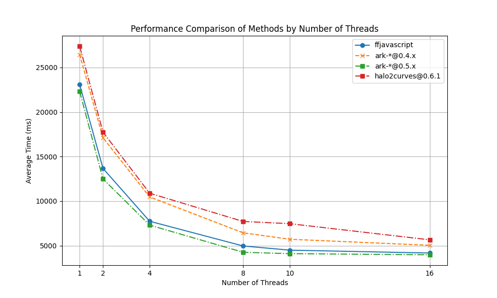

# wasm-multiexp-bench

This repository contains a set of benchmarks for the `ffjavascript` (`wasmcurves`) and Arkworks. We are comparing
multi-exponentiation on the BLS12-381 curve.

## Usage

First, build WASM dependencies with:

```bash
bash scripts/build.bash
```

You may run tests with:

```bash
bash scripts/test.bash
```

### Benchmarks

Compare performance of `ffjavascript`, `ark-*@0.5.0` and `ark-*@0.4.x` crates by running:

```bash
bash scripts/benchmark.bash
```

Generate combined results file and plot results:

```bash
# pip install matplotlib
python scripts/plot-benchmark.py
```

### Results

See `./benchmark-results` to find persisted benchmark results.

You can view tracing files (JSON files) using [CPUPro](https://discoveryjs.github.io/cpupro/)

#### Performance comparison


